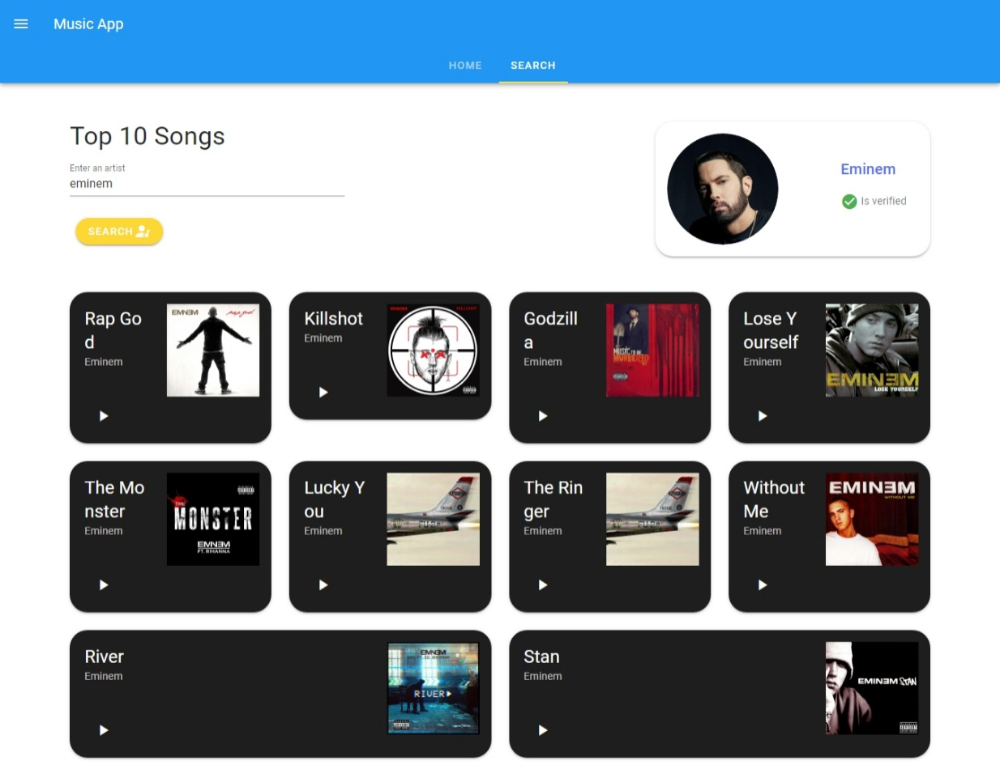
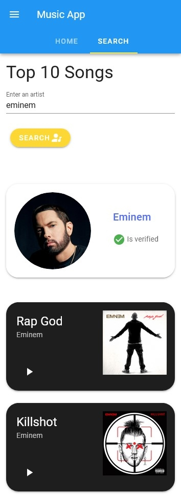

# Vue Top 10 Songs API 🎵

## Table of Content

- [About The Project](#about-the-project)
  - [Description](#description)
  - [Built With](#built-with)
- [Installation](#installation)
- [Usage](#usage)
- [Demo](#demo)
- [Contact](#contact)

## About The Project





## Description

This project is about a search for the Top 10 Songs of an artist made with VueJS that consumes a [Genius](https://genius.com) API.

## Built With

[](https://vuejs.org)

[](https://vuetifyjs.com)

## Installation

1. Clone the repo and change "my-project" to your project name.

```sh
  git clone https://github.com/josemiguel02/vue-top-10-songs-api.git ./my-project
```

2. Go to the project directory

```sh
  cd my-project
```

3. Install NPM packages

```npm
  npm install
```

## Usage

Run the project in development

```npm
  npm run serve
```

Build the project

```npm
  npm run build
```

## Demo

- [View demo](https://vue-api-search-music.pages.dev)

## Contact

- Gmail - [josemidev24@gmail.com](mailto:josemidev24@gmail.com)
- Instagram - [@jmdp.02](https://www.instagram.com/jmdp.02)
